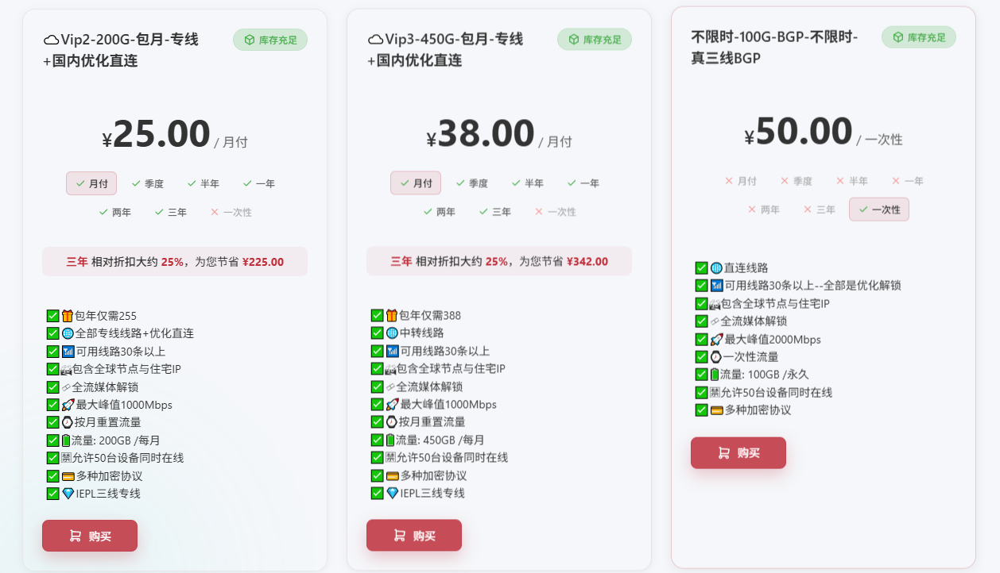
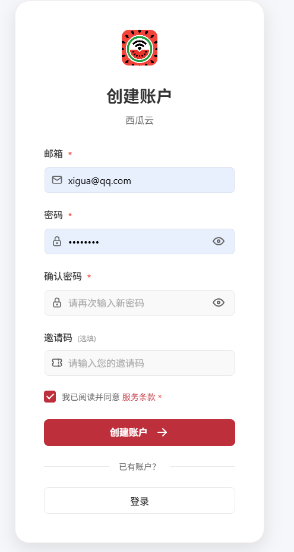
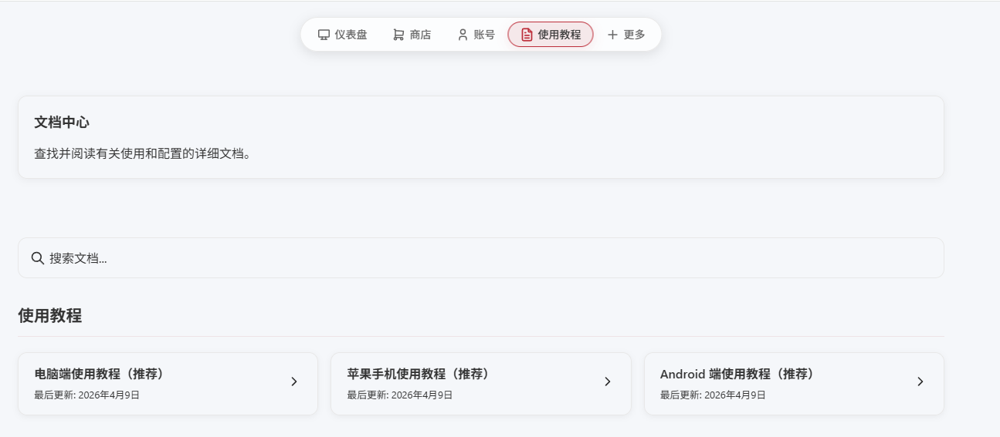
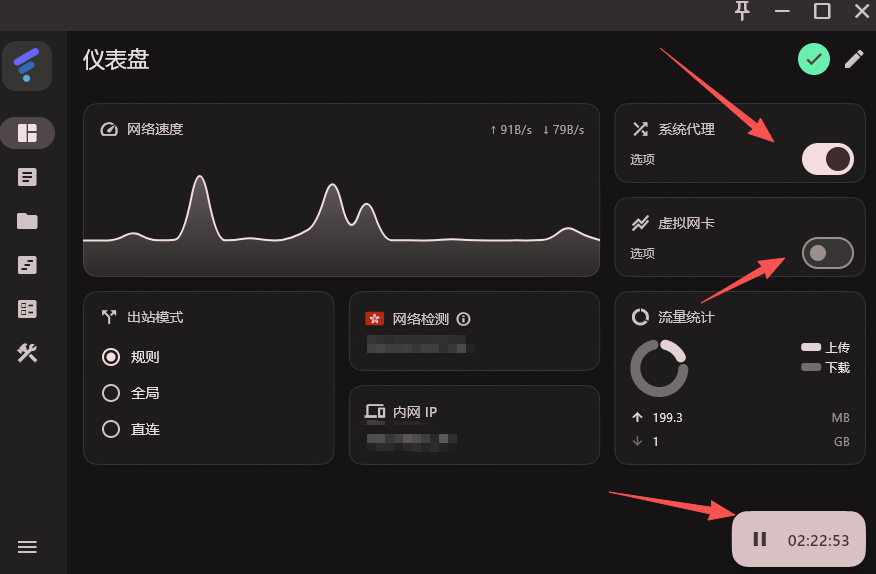
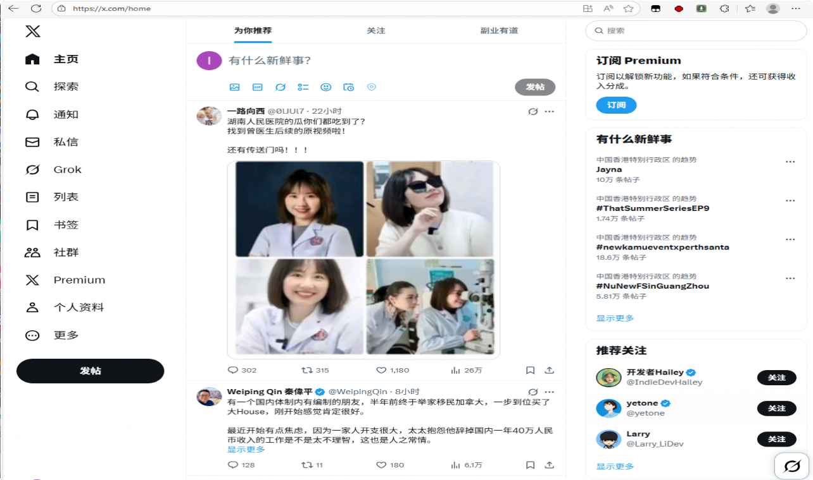
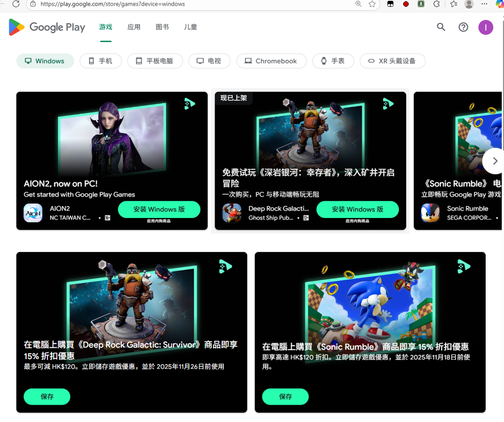
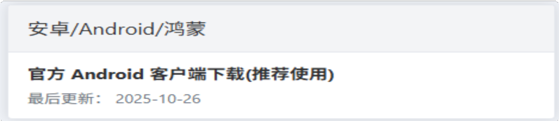

实测「西瓜云」教程，强烈推荐！👉👉👉 [一键注册](https://sw.xiguashangwang.top/?u=github)

这款Tizi 我个⼈也⽤了3 个⽉了，体验确实还可以了，平时主要⽤来看X 的帖⼦、逛逛V2ex、看看Tk。

⼗分稳定、速度块、价格便宜，所以强烈推荐！

{:height="50%" width="50%"}

#### 1、为什么推荐西瓜云？

1、浏览TK 视频、Yutube 视频没有出现卡顿的现象，还是⽐较丝滑的。

2、⽀持Windows、iOS（iPhone/iPad）、Android、Mac、Linux，团队还是蛮全⾯的，值得信赖。

3、没有出现封号现象，使⽤⼀些免费的TZ，节点不稳定，很容易出现封号（AppleID、⾕歌账号）。如果你经常使⽤某歌账号，强烈不建议使⽤免费的TZ。

4、价格还算良⼼，每⽉25 元200 个G，这个价格相对来说属于中等，有些软件⽐较贵需要30多⼀个⽉。当然便宜的也有⼏块钱⼀个⽉。（注意：太便宜反⽽是个“坑”，这类⼯具运营也是有很⼤成本的）。甚⾄还有些“贵得离谱”，需要40 多RMB ⼀个⽉：

5、运营稳定，很多软件付费了，玩了⼀段时间它就跑路了！

#### 2、免费试⽤

免费试⽤的时间是24  ⼩时，如果仅仅只是偶尔使⽤的话，直接免费试⽤这款TZ，也是个不错的选择（现在好像没有，问了团队说现在成本太高了）。

#### 3、使⽤教程

准备⼀个邮箱即可完成注册，注册地址：👉👉👉 [西瓜云（TiZi）注册地址](https://sw.xiguashangwang.top/?u=github)

{:class="img-responsive"}

#### 4、下载客⼾端

#### 5、Windows 使⽤教程

Windows 客⼾端使⽤注意2 点：

1、安装完成之后，⾸次使⽤，请⿏标右键，以管理员⾝份运⾏本程序。

2、打开「系统代理」即可开始使⽤，我建议打开「全局」、「虚拟⽹卡」，右侧的节点可以随意切换。

实测效果：

1、访问X 没问题

2、访问⾕歌商店没问题

#### 6、Android 使⽤教程

⽀持鸿蒙系统，只要能安装上apk（安卓安装包⽂件格式）即可

登录完成后，打开 连接开关 即可开始使⽤我们的服务。

体验⼀下TK 视频，没有任何卡顿现象

#### 7、联系客服

从⽹站中进⼊客服咨询：
